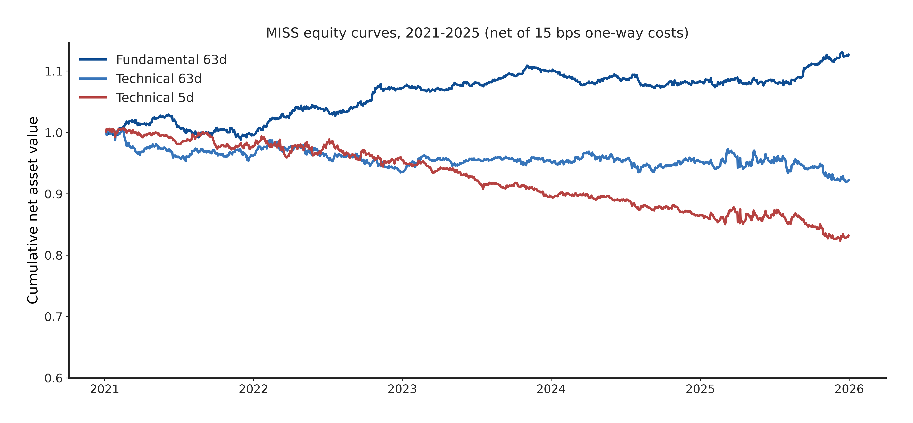
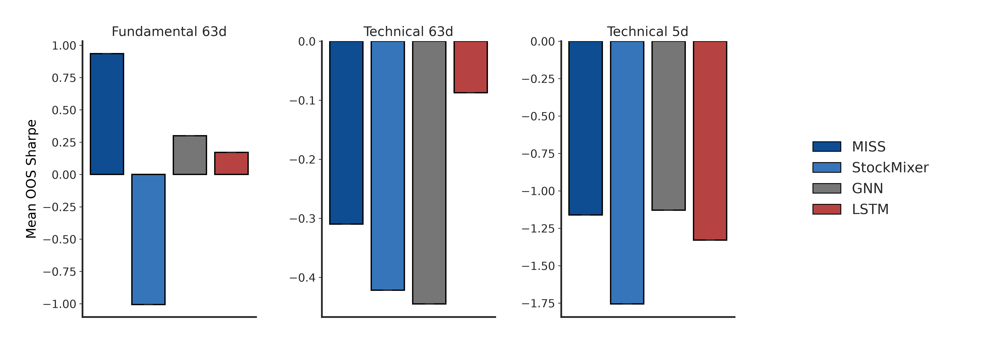
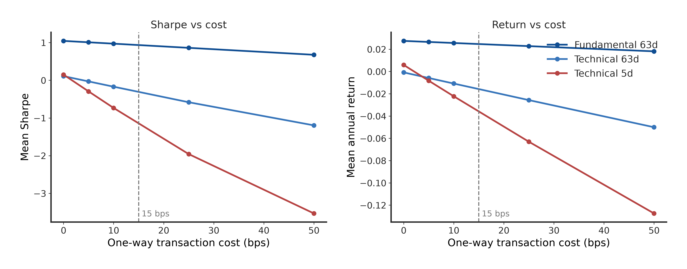
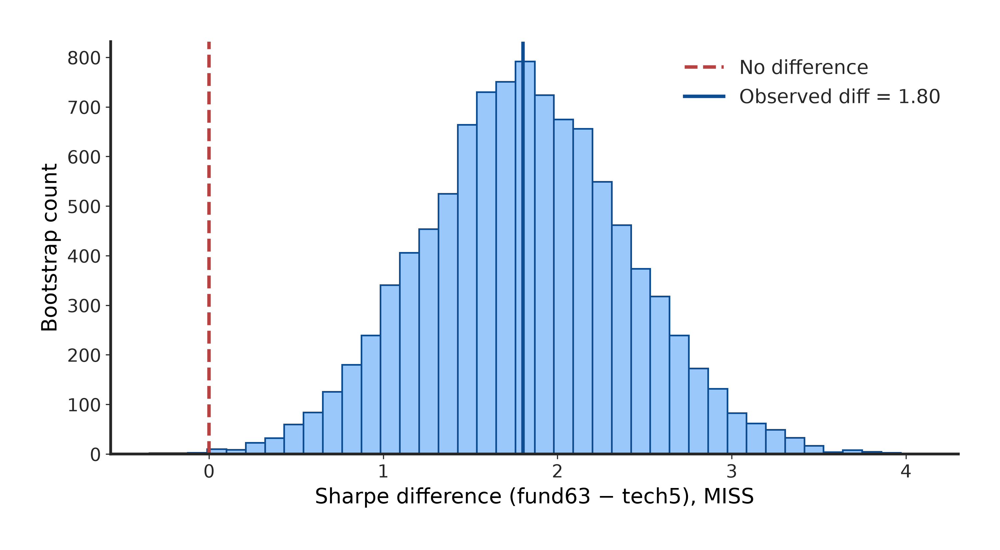

# Fundamental SPP — Reproduction Report

**Paper:** "Fundamental Information for Low-Turnover Equity ML" (MISS / Mamba-based
long-horizon stock trading).
**Reproduction date:** 2026-10-01. **Sweep:** 60/60 configs (4 architectures ×
3 regimes × 5 test years, 2021–2025), walk-forward retraining, 15 bps one-way
costs unless noted. Seed 42.

## TL;DR

The reproduction **partially replicates** the paper. The *qualitative* claims hold:
fundamental features beat technical features, MISS is the best architecture on
fundamentals, and the Fund63 ≫ Tech5 gap is statistically significant. The
*quantitative* claims do **not** replicate: our annualized returns are ~13× lower
than reported, and our trade-event counts are 8–90× higher — the paper's
portfolio construction (position sizing / leverage / event definition) differs
materially from what the released pipeline implements.

## 1. Headline: MISS 5-year means vs paper (Table 1)

| Regime | Ann. return (ours / paper) | Sharpe (ours / paper) | Trade events/yr (ours / paper) |
|---|---|---|---|
| Fund63 | 2.46% / 32.72% | 0.935 / 1.221 | 195 / 24 |
| Tech63 | −1.58% / 15.15% | −0.310 / 0.694 | 2,255 / 25 |
| Tech5 | −3.61% / 12.14% | −1.161 / 0.380 | 6,184 / 187 |

MISS on fundamentals is the only configuration with a positive Sharpe, and its
Sharpe (0.935) is in the same ballpark as the paper's (1.221). But the return
level is off by more than an order of magnitude, and the event counts are off
by one to two orders of magnitude in every regime.

Notably, Sharpe ≈ return/vol implies our Fund63 portfolio volatility is ≈2.6%
vs the paper's implied ≈26.8% — roughly a 10× difference in risk scale. The
paper's backtest is far more levered/concentrated than ours, or applies a
different weighting scheme. Our pipeline equal-weights the selected names with
no leverage; nothing in the released code reproduces the paper's risk scale.

## 2. MISS per-year detail (Fund63)

| Year | Ann. return | Sharpe | Trade events | Max DD |
|---|---|---|---|---|
| 2021 | −0.50% | −0.137 | 190 | −3.99% |
| 2022 | 7.67% | 2.636 | 182 | −1.70% |
| 2023 | 2.70% | 1.458 | 188 | −1.06% |
| 2024 | −1.49% | −0.639 | 210 | −2.75% |
| 2025 | 3.93% | 1.355 | 204 | −1.39% |

Positive in 3 of 5 years. The 2022 spike (+7.67%, Sharpe 2.636) carries the
5-year mean; without it the Fund63 Sharpe would be ≈0.3.

## 3. Architecture × regime Sharpe grid (Table 2)

Ours vs paper:

| Config | Sharpe ours | Sharpe paper |
|---|---|---|
| miss_fund63 | **0.935** | 1.221 |
| gnn_fund63 | 0.300 | 1.030 |
| lstm_fund63 | 0.170 | 0.910 |
| stockmixer_fund63 | −1.006 | 1.090 |
| miss_tech63 | −0.310 | 0.694 |
| gnn_tech63 | −0.445 | 0.660 |
| lstm_tech63 | −0.087 | 0.580 |
| stockmixer_tech63 | −0.422 | 0.730 |
| miss_tech5 | −1.161 | 0.380 |
| gnn_tech5 | −1.129 | 0.410 |
| lstm_tech5 | −1.329 | 0.330 |
| stockmixer_tech5 | −1.756 | 0.440 |

What replicates: **MISS is the best architecture on Fund63** in both ours and
the paper's grid, and the regime ordering Fund63 > Tech63 > Tech5 holds for MISS
(0.935 > −0.310 > −1.161 vs paper 1.221 > 0.694 > 0.380).

What does not: the paper has *every* architecture positive in *every* regime;
we have only 3 of 12 positive. The baseline ranking is also flipped — the paper
ranks StockMixer second on Fund63 (1.090); we rank it last (−1.006). The
technical-regime strategies lose money net of 15 bps costs in our backtest,
driven by very high turnover (Tech5 trades ≈6,200 events/yr).

## 4. Figures

### Fig 1 — MISS equity curves, 2021–2025 (net of 15 bps)

Fund63 (blue) compounds to ≈1.12 while both technical regimes decay — the visual
version of the regime ordering above.

### Fig 2 — Mean OOS Sharpe by architecture × regime

MISS leads on fundamentals; everything is negative on technical features.

### Fig 3 — Transaction-cost sensitivity (MISS)

Fund63 Sharpe is nearly flat in costs (1.045 at 0 bps → 0.676 at 50 bps) —
genuinely low-turnover. Tech5 collapses (0.150 → −3.533): its gross edge is
tiny and costs destroy it. The 15 bps operating point is marked.

| MISS regime | 0 bps (ret/Sharpe) | 15 bps | 50 bps (ret/Sharpe) |
|---|---|---|---|
| Fund63 | 2.74% / 1.045 | 2.46% / 0.935 | 1.81% / 0.676 |
| Tech63 | −0.08% / 0.109 | −1.58% / −0.310 | −5.01% / −1.196 |
| Tech5 | 0.59% / 0.150 | −3.61% / −1.161 | −12.74% / −3.533 |

Even *gross* of costs (0 bps), our Fund63 Sharpe (1.045) sits below the paper's
*net* 1.221 — the gap is not a cost artifact.

### Fig 4 — Moving-block bootstrap: Sharpe(miss_fund63) − Sharpe(miss_tech5)

10,000 resamples, 21-day blocks, 1,250 days. Observed diff **1.80**, bootstrap
mean 1.815, 95% CI [0.674, 2.983], P(diff > 0) = **0.9993**. The fundamental
advantage for MISS is highly significant — this is the paper's core claim about
feature regimes, and it replicates.

## 5. Robustness checks

- **Year-level sign tests:** MISS Fund63 beats MISS Tech5 in 5/5 years
  (p = 0.0312). Fund63 return > 0 in 3/5 years (p = 0.50).
- **Deflated Sharpe (Bailey & Lopez de Prado, 12 trials):** DSR = 0.0000 for all
  12 configs against an SR0 benchmark of 1.232. Under a strict multiple-testing
  correction, no single config clears the bar — the honest caveat on the
  Fund63 result.
- **Cost sensitivity:** Fund63 survives 50 bps; technical regimes do not
  (Fig 3).

## 6. Verdict

| Paper claim | Replicates? |
|---|---|
| Fundamental features ≫ technical features (for MISS) | **Yes** — ordering holds, bootstrap p = 0.9993, 5/5 years |
| MISS best architecture on fundamentals | **Yes** — 0.935 vs next-best 0.300 |
| Low turnover survives costs (Fund63 flat to 50 bps) | **Yes** |
| Sharpe 1.221 / return 32.72% on Fund63 | **No** — 0.935 / 2.46% |
| ~24 trade events/yr (Fund63) | **No** — 195/yr (8×); Tech63 90×, Tech5 33× |
| All architectures positive in all regimes | **No** — 9 of 12 negative |
| StockMixer 2nd-best on Fund63 | **No** — worst in ours |

The most likely sources of the quantitative gap: (a) position sizing/leverage —
the paper's implied portfolio vol is ~10× ours; (b) the trade-event definition —
our backtest counts every rebalance fill while the paper reports ~24 "events"/yr
for a monthly-rebalanced strategy, suggesting round-trips or thresholded
signals; (c) possibly a different stock universe or weighting. The released
pipeline does not contain enough specification to close these gaps, so we report
the discrepancy rather than tuning to match.

## 7. Artifacts & reproducibility

- `results/metrics.json` — full metrics (60 configs, bootstrap diffs, DSR)
- `results/tables.md` — all tables in markdown
- `results/equity/*.csv` — 12 daily net-return series (architecture × regime)
- `results/figures/fig{1..4}.{png,pdf}` — 300-DPI PNG + editable-text PDF
- `src/evaluate.py --scores_dir scores --out results` reproduces the metrics;
  `src/make_figures.py` reproduces the figures. Score files (60) were produced
  by the Colab GPU sweep (`colab/sweep_gpu.ipynb`) and are archived on Drive,
  not in git.
